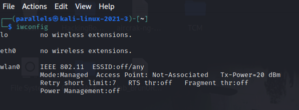
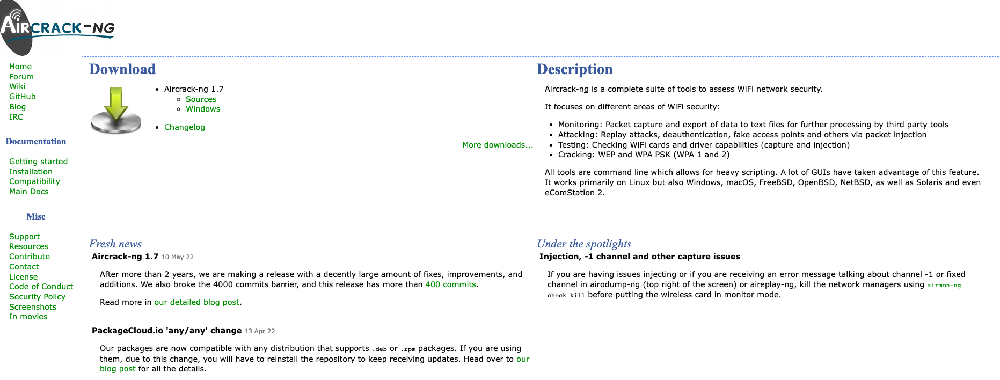

# WIFIHACKING

## WIfi Hacking V3

**First step plug the wifi network card to my Kali VM**

use iwconfig to see card's settings

 

Let's use aircrack-ng in most of the attacks.

## Basic Terminology
* AP - This is the access point or the place where the clients connect to the Wi-Fi and get Internet access.
* PSK - Pre-Shared-Key This is the password used to authenmticate to the AP.
* SSID - The name used to identify of the AP.
* ESSID- (exteded service set identifier) same as teh ssid but can be used for multiple AP's in a wireless LAN
* BSSID - (bbasic service set identifier)this is the unique identifier for every AP. it's the same as the MAC address of the AP.
* Channels -WiFi operates on channels 1-14 but is limited to 1-11 in the US.
* Power - The closer you are to the AP the stronger the signal. The signal in the U.S is limited to .5 watts by the FCC.
* Security - These is the security protocol to authenticate and encryot Wi-Fi traffic the most popular at this time is WPA-PSK
* Modes - WiFi can operates in three modes, master,managed and monitor. AP's operate sin master mode, wireless network interfaces operates in managed mode by default, and hackers  operates in monitor mode.
* Range - At legal limit of .5 watts, most WIFI AP's are accessible up to 300ft but with high gain antennas can be accesible up to 20 miles.
* Frequency - Wi-Fi is designed to operate at 2.4GHZ and 5GHZ. MOst modern systems now use both.
